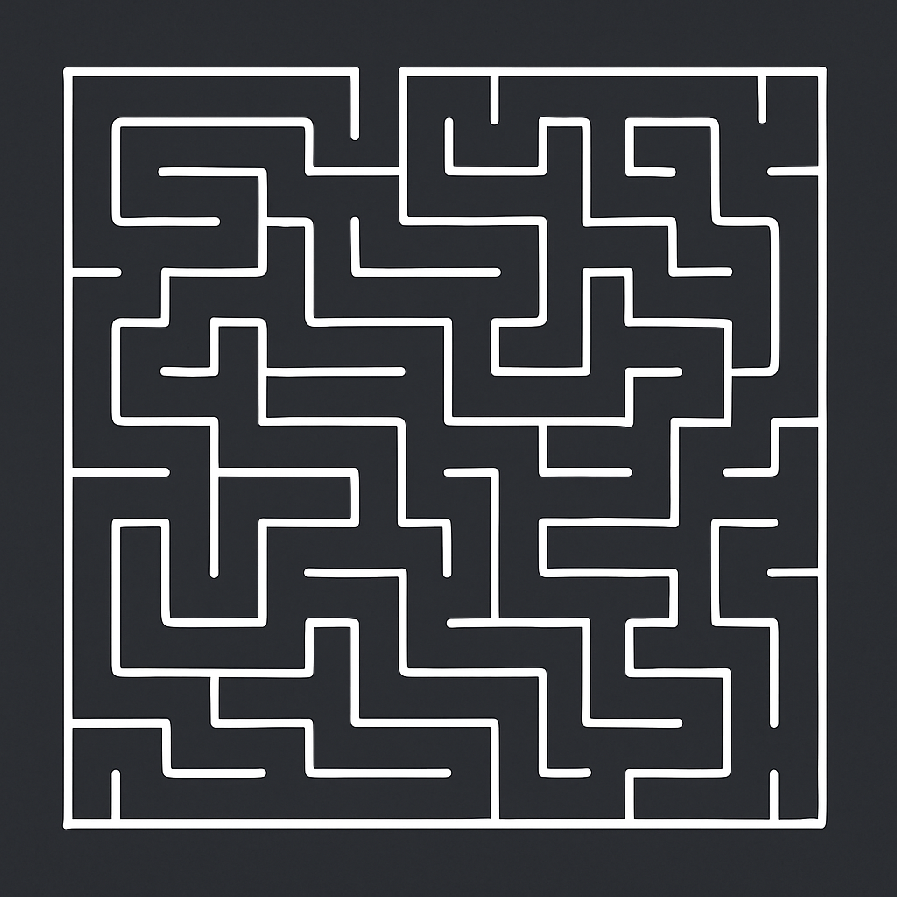

# Maze Runner 🏃‍♂️🌲

**Maze Runner** is an interactive command‑line game where you navigate through
a randomly generated maze.  The goal is simple: find your way from the top‑left
corner to the exit at the bottom‑right.  Along the way you can toggle the
solution path, generate a new maze, or enjoy the satisfaction of solving it
on your own.



## Features

- **Random mazes** — each game presents a unique challenge
- **Interactive movement** using the arrow keys
- **Shortest path hint** — press `s` to reveal the optimal solution
- **New maze on demand** — press `n` to start over with a fresh maze
- **Minimal dependencies** — built with Python’s standard library only

## Getting Started

1. **Clone or download this repository**.
2. Ensure you have **Python 3.8+** installed.
3. Install any optional dependencies if you plan on modifying the game to use external packages (not required for the base game).

To run the game:

```bash
python maze_game.py
```

## Gameplay

Once started, the terminal displays a maze composed of walls (`█`) and
passages (` `).  Your player character is represented by an **`@`** symbol, and
the goal is marked with an **`X`**.  Use the arrow keys to navigate through
the passages.

### Controls

| Key               | Action                                              |
|-------------------|------------------------------------------------------|
| **↑ ↓ ← →**       | Move up, down, left or right                         |
| **s**             | Toggle display of the shortest solution path        |
| **n**             | Generate a new maze                                 |
| **q**             | Quit the game                                       |

When you reach the goal, a congratulatory message appears.  You may then
generate another maze or exit the game.

## How It Works

The maze is generated using a **depth‑first search (DFS)** algorithm (also
known as recursive backtracking).  The maze grid uses odd cell indices for
passages and even indices for walls.  The solver employs a **breadth‑first
search (BFS)** algorithm to compute the shortest path from the player’s
position to the exit.

## Contributing

If you have ideas for enhancing this game — adding levels, timed challenges,
or graphical interfaces — feel free to fork the project and submit a
pull request.  Contributions are welcome!

## License

This project is released under the **MIT License**.  See the
[LICENSE](LICENSE) file for details.
